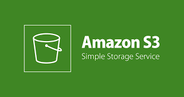

 
  <h1>Final Project: AWS Cloud at Factory F5</h1>
  

## Challenge 1: Setting up a Static Website on Amazon S3

### Description
Create a static website where the team members are presented on one or multiple pages.

#### Minimum Requirements:
- Include the name, place of birth, and hobbies of each member.

#### Presentation:
- Showcase the website in operation with a URL in WEB format.
- Provide the URL to the jury for access.
- Present the architecture design of how the website was set up.

---

## Challenge 2: Creating a Presigned URL on Another S3

### Description
Create a presigned URL in a different S3 bucket, with a duration of 3 minutes, to share an image representing the team's vision for the future with AWS.

#### Minimum Requirements:
- The presigned URL must be in a different S3 bucket from the static website.

#### Presentation:
- Provide the presigned URL to the jury.
- Demonstrate that the access expires correctly after the stipulated time.

---

## Challenge 3: Setting up a Static Website on EC2 with ELB

### Description
Recreate the same static website from S3 on three EC2 instances within the same region and connect them to an Elastic Load Balancer (ELB).

#### Minimum Requirements:
- Include the name, place of birth, and hobbies of each member.
- Include the following code snippet somewhere in the code: `
EC2 response: $(hostname -f) 
`, which will display which EC2 is responding.
- Connect an ELB to the three EC2 instances.

#### Presentation:
- Provide the URL of the ELB to the jury.
- Demonstrate that refreshing the page changes the responding EC2.
- Present the architecture design of how the solution was set up.

---

## Considerations:
- Presentation: It must be clear and concise, explaining how the team organized, worked, and what tools were used. (10 min presentation + 5 questions + 5 jury feedback)
- Design: Describe the design of what was done.
- Workflow: Explain the workflow.
- Challenges: Mention the difficulties encountered and how they were resolved.
- Diagram Design: Include a diagram of the architecture design.

## Herramientas Utilizadas

 

## Team Members:

  - LinkedIn: [Guadalupe Hani](https://www.linkedin.com/in/guadalupe-hani/)

  - LinkedIn: [Daniela Aguirre](https://www.linkedin.com/in/ruth-daniela-aguirre/)
  - LinkedIn: [Ana Lucía Silva Córdoba](https://www.linkedin.com/in/ana-lucia-silva-cordoba/)

  - LinkedIn: [Susana Cortés](https://www.linkedin.com/in/susanacort%C3%A9sarroyo/)

  - LinkedIn: [Annie Moneva](https://www.linkedin.com/in/antoaneta-moneva-428a17a2/)
  - LinkedIn: [Carolina Fuentes](https://www.linkedin.com/in/carolina-bolivar-ab9028208/)
  - LinkedIn: [Mohamed Alisawi](https://www.linkedin.com/in/mohammed-alisawi-aloroza/)

